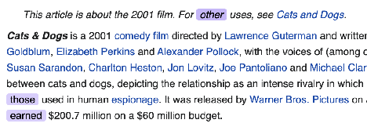

# Angular Chrome extension for cats and dogs lovers

Example of browser plugin implementation with `popup` template in Angular.

 
  
The task is to create a Chrome extension for cats and dogs lovers

 

If enabled, the extension should replace *"cat"* / *"dog"* words (depending on user preference) from every webpage, highlight mentions of the user's favorite animal, and show some pictures of it upon clicking.

We use Angular in our content scripts, but you can use any frameworks or libraries you like, or none at all.

Below you will find a more detailed description of each feature, along with some design mock-ups for layouting \- the result may not be pixel-perfect, but it should look good and work reliably on most websites.

**Figma mock-ups:**
[https://www.figma.com/file/9AQuNYlgGOG6JkxYeZ1k49/Linguix-JS-Test-Assignment](https://www.figma.com/file/9AQuNYlgGOG6JkxYeZ1k49/Linguix-JS-Test-Assignment)

Please upload your project to GitHub/GitLab/wherever you like, along with instructions on how to build it.

## Extension installed page

A simple welcome page should appear after the user installs the extension, allowing them to select whether they prefer cats, dogs, or both.

The link on the button should lead here: [https://en.wikipedia.org/wiki/Cats\_%26\_Dogs](https://en.wikipedia.org/wiki/Cats\_%26\_Dogs)

## Popup window

The Popup window should contain the same two switches for cats/dogs preferences, along with a switch that can disable the extension. It is possible to love both dogs and cats at the same time.  
If a user changes her preferences, all currently open pages should be updated as well.

**Optional:** Bonus points for an additional toggle switch that disables the extension for the website opened in the currently active tab.

## Content script

The extension, if it is enabled globally and if it is enabled for a specific webpage, should amend the content on it according to the following rules:

* If user loves only cats – replace every “dog” word with a “cat”
* If user loves only dogs – replace every “cat” with a “dog”
* In case the user loves both, or does not care for either – don't do anything

*(We know the page will not make any sense after that,*   
*but who cares when you want more cat images?)*

The extension should highlight every *“dog”* and *“cat”* word on the webpage like in the following image, where words *other, those* and *earned* are highlighted:  

When any highlighted word is clicked, a popup window should appear below or above it, wherever there is more space, with a random picture of the corresponding animal.  

This popup window can be closed by clicking on the “X” button, or anywhere outside of it.

You can use the following APIs to fetch pictures:  
[https://dog.ceo/dog-api/](https://dog.ceo/dog-api/) for dogs  
[https://docs.thecatapi.com/](https://docs.thecatapi.com/) for cats

 
  
Task solve

1. The server is implemented in the functions folder based on `yandex serverless functions`. It is used to select a picture.
2. To build the plugin run : `npm run build`.

